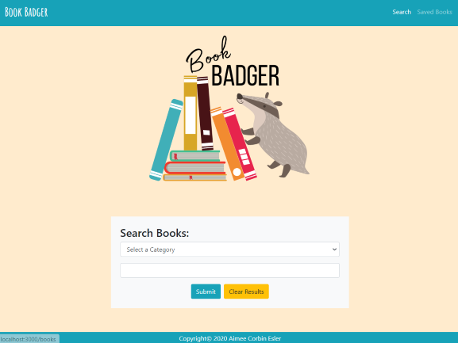
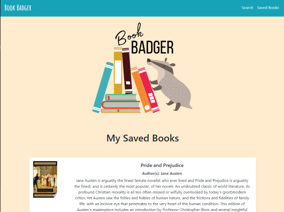

# # REACT GOOGLE BOOKS APP

The purpose of this app is for a user to be able to search books by title or author and save books that they find to their favorites.

---

## Table of Contents

- [Installation](#installation)
- [Usage](#Usage)
- [Building the Application](#building-the-application)
- [Acceptance Criteria](#acceptance-criteria)
- [Credits](#credits)
- [Resources](#resources)
- [Contact](#contact)
- [Links](#Links)
- [License](#license)

---

## Installation

1. Follow the GitHub Repository Link in the [links](#Links) section below.
1. Clone the repository using an SSH key.
1. Open GitBash and use "git clone" to clone the repository.
1. Run npm install to install associated modules.

---

## Usage

Edit using VSCode after [installation](#installation). This is a full stack MERN application, all files and components are included. This application is deployed to Heroku, see [links](#Links) section below.

---

## Building the Application

While building this application I chose to go with a fun "Book Badger" theme and bright color scheme. From the home page the user can chose to search by either title or author for a book. There is validation included so that the user must enter both a category and a search term. Once a search has been made, the results display below in individual cards with an image, title, authors, and description of each book. There is also validation should a search not yield any results. There are also two buttons on each card one that takes the user to the google books page for the selected book and one that adds that book to the favorites. Once a book has successfully been added to the favorites, a modal will appear confirming the add. The user can then choose to continue searching, clear the page or go to the Saved page to view their saved favorites.

Once on the Saved page, the user can view all of the books they have saved, if they have not saved any yet a card will appear to let the user know they don't have any saved books yet. The saved books will display much like the search results and will contain two buttons, one for more information and one that will delete the book from the favorites. If a book is deleted the page will automatically update and remove that book.

---

## Acceptance Criteria

1. This application requires at minimum 2 pages: :heavy_check_mark:

  * Search - User can search for books via the Google Books API and render them here. User has the option to "View" a book, bringing them to the book on Google Books, or "Save" a book, saving it to the Mongo database. :heavy_check_mark:

  * Saved - Renders all books saved to the Mongo database. User has an option to "View" the book, bringing them to the book on Google Books, or "Delete" a book, removing it from the Mongo database. :heavy_check_mark:

2. Add code to connect to a MongoDB database named `googlebooks` using the mongoose npm package. :heavy_check_mark:

3. Using mongoose, then create a Book schema. :heavy_check_mark:

4. At a minimum, books should have each of the following fields: :heavy_check_mark:

* `title` - Title of the book from the Google Books API :heavy_check_mark:

* `authors` - The books's author(s) as returned from the Google Books API :heavy_check_mark:

* `description` - The book's description as returned from the Google Books API :heavy_check_mark:

* `image` - The Book's thumbnail image as returned from the Google Books API :heavy_check_mark:

* `link` - The Book's information link as returned from the Google Books API :heavy_check_mark:

5. Create a layout similar to the mockups given. This should be a SPA (Single Page Application) that uses 'react-router-dom' to navigate, hide and show your React components without changing the route within Express. :heavy_check_mark:

* The layout should include at least two React Components for each page `Search` and `Saved`. :heavy_check_mark:

* Feel free to try out alternative CSS framework to Bootstrap. :heavy_check_mark:

6. Add the following Express routes for your app: :heavy_check_mark:

* `/api/books` (get) - Should return all saved books as JSON. :heavy_check_mark:

* `/api/books` (post) - Will be used to save a new book to the database. :heavy_check_mark:

* `/api/books/:id` (delete) - Will be used to delete a book from the database by Mongo `_id`. :heavy_check_mark:

* `*` (get) - Will load your single HTML page in `client/build/index.html`. Make sure you have this _after_ all other routes are defined. :heavy_check_mark:

* Deploy your application to Heroku once complete. **You must use Create React App** and current versions of React and React-Router-Dom for this assignment. :heavy_check_mark:

---

## Credits

As always, a huge thanks to our instructional staff for all their hard work!

## Resources

- [w3schools](https://www.w3schools.com)
- [Node.js](https://nodejs.org/en/)
- [React.js](https://reactjs.org/)
- [Bootstrap](https://getbootstrap.com/)
- [Axios](https://www.npmjs.com/package/axios)
- [Express](https://expressjs.com/)
- [MongoDB](https://www.mongodb.com/)
- [Mongoose.js](https://mongoosejs.com/)
- [MongoDB Atlas](https://www.mongodb.com/cloud/atlas)
- [Heroku](https://heroku.com)

---

## Contact

Find me on LinkedIn Here:
[Aimee Esler](https://www.linkedin.com/in/aimee-esler-3bb31288/)

---

## Links

[Repository Link](https://github.com/aimeecesler/react-book-app)

[Deployed Application](https://ace-google-books.herokuapp.com/)

---

## License

Copyright &copy; 2020 Aimee Corbin Esler

    Permission is hereby granted, free of charge, to any person obtaining a copy
    of this software and associated documentation files (the "Software"), to deal
    in the Software without restriction, including without limitation the rights
    to use, copy, modify, merge, publish, distribute, sublicense, and/or sell
    copies of the Software, and to permit persons to whom the Software is
    furnished to do so, subject to the following conditions:

    The above copyright notice and this permission notice shall be included in all
    copies or substantial portions of the Software.

    THE SOFTWARE IS PROVIDED "AS IS", WITHOUT WARRANTY OF ANY KIND, EXPRESS OR
    IMPLIED, INCLUDING BUT NOT LIMITED TO THE WARRANTIES OF MERCHANTABILITY,
    FITNESS FOR A PARTICULAR PURPOSE AND NONINFRINGEMENT. IN NO EVENT SHALL THE
    AUTHORS OR COPYRIGHT HOLDERS BE LIABLE FOR ANY CLAIM, DAMAGES OR OTHER
    LIABILITY, WHETHER IN AN ACTION OF CONTRACT, TORT OR OTHERWISE, ARISING FROM,
    OUT OF OR IN CONNECTION WITH THE SOFTWARE OR THE USE OR OTHER DEALINGS IN THE
    SOFTWARE.
